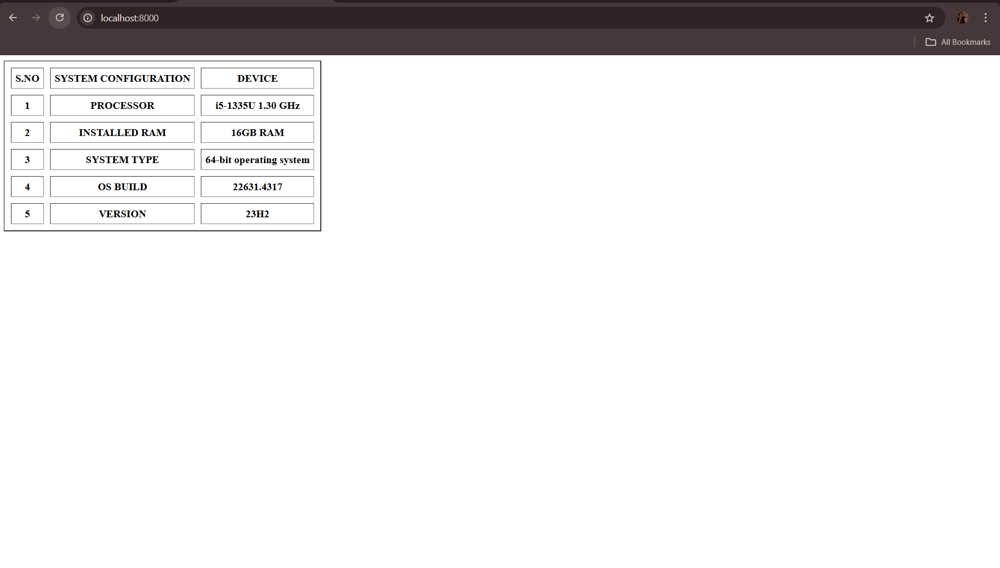

# EX01 Developing a Simple Webserver
## Date:25.10.2024

## AIM:
To develop a simple webserver to serve html pages and display the configuration details of laptop.

## DESIGN STEPS:
### Step 1: 
HTML content creation.

### Step 2:
Design of webserver workflow.

### Step 3:
Implementation using Python code.

### Step 4:
Serving the HTML pages.

### Step 5:
Testing the webserver.

## PROGRAM:
'''
from http.server import HTTPServer,BaseHTTPRequestHandler

content="""
<!DOCTYPE html>
<html>
    <head>
        <title>COMPUTER CONFIGURATION</title>
    </head>
    <body>
        <table border="2" cellspacing="10" cellpadding="6">
            <tr>
                <th>S.NO</th>
                <th>SYSTEM CONFIGURATION</th>
                <th>DEVICE</th>
            </tr>
            <TR>
                <th>1</th>
                <th>PROCESSOR</th>
                <th>i5-1335U   1.30 GHz</th>
            </TR>
            <TR>
                <th>2</th>
                <th>INSTALLED RAM</th>
                <th>16GB RAM</th>
            </TR>
            <TR>
                <th>3</th>
                <th>SYSTEM TYPE</th>
                <TH>64-bit operating system</TH>
            </TR>
            <TR>
                <TH>4</TH>
                <TH>OS BUILD</TH>
                <TH>22631.4317</TH>
            </TR>
            <TR>
                <TH>5</TH>
                <TH>VERSION</TH>
                <TH>23H2</TH>
            </TR>
        </table>
    </body>
</html>
"""

class MyServer(BaseHTTPRequestHandler):
    def do_GET(self):
        print("Get request received...")
        self.send_response(200) 
        self.send_header("content-type", "text/html")       
        self.end_headers()
        self.wfile.write(content.encode())

print("This is my webserver") 
server_address =('',8000)
httpd = HTTPServer(server_address,MyServer)
httpd.serve_forever()
'''

## OUTPUT:

## RESULT:
The program for implementing simple webserver is executed successfully.
